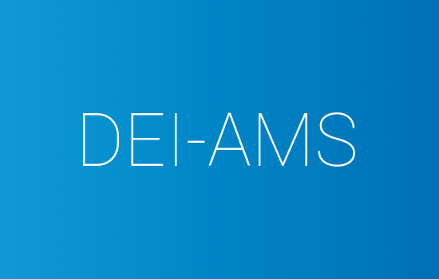

<h1 align="center"> DEI Academic Management System - AMS </h1>



This project was developed as an application for the DEI scholarship.

The system's main goal is to centralize the management of Curricular Units (UCs), providing a single, functional interface for Students, Professors (Regents and Assistants), and Administrators to manage academic workflows. It handles everything from course enrollment and assessment creation to project submissions and a structured grade review process.

## Implemented Features

### Mandatory Features

* **Course & UC Management:** View, create, update, and remove Courses and Curricular Units (UCs).
* **People Management:** Manage users (Students, Assistants, Regents, Admins) and enroll/remove them from UCs.
* **Class Visualization:** View all students and professors associated with a specific UC.
* **Assessment Management:** Create and manage tests and projects, including their weights and deadlines.
* **Grading System:** Allow professors to assign grades to students for tests and projects.
* **Project Submissions:** Allow students to submit project files (individually or as a group).
* **Group Management:** Automatically create and manage student groups for projects.
* **Resource Management:** Upload and manage course materials, such as syllabi and project briefs.
* **Grade Review Workflow:** A complete, multi-step process for students to request grade reviews and for professors to respond.
* **Calendar:** View an assessment calendar with automatic conflict detection.
* **Student Profile:** A dedicated view for students to see their enrolled UCs, grades, and pending assessments.

### Additional Features

To achieve a higher score, several advanced features were implemented:

* **Email & In-App Notifications:** Automatic notifications for key events like new grades, project submissions, and review requests, using [MailCrab](https://github.com/tweedegolf/mailcrab) for local testing.
* **Personalized Dashboards:** Custom views for Students (grades, deadlines), Professors (pending corrections, stats), and Assistants (grading tasks).
* **Advanced UC Statistics:** A page showing grade distributions, averages per assessment, and the number of review requests.
* **Multiple Project Submissions:** Allows students to submit multiple versions of a project, with only the last one being considered for grading.

---

## Dependencies

- Require download
  - [Java 21](https://www.oracle.com/java/technologies/javase/jdk17-archive-downloads.html)
  - [Maven](https://maven.apache.org/download.cgi)
  - [Node 14+](https://nodejs.org/en/) ([Node Version Manager](https://github.com/nvm-sh/nvm) recommended)
  - [Docker](https://www.docker.com/)
- No download required
  - [Spring-boot](https://spring.io/)
  - [Vue.js](https://vuejs.org/)


## Run Locally

Clone the project

```bash
git clone git@github.com:joaosviegas/DEI-AMS.git
```

Go to the project directory

```bash
cd src/
```

### Database

To run the database with Docker (recommended), run the following command:

```bash
docker compose up
```

Alternatively, you can create services that will be run in the background:

```bash
docker compose up -d
```

To stop the database, run the following command:

```bash
docker compose down
```

### Backend

Create a copy of the `application-local.properties` file.

```bash
cp ./backend/src/main/resources/application.properties.example ./backend/src/main/resources/application.properties
```

If you're running your database using Docker, the datasource variables should match the ones in `Docker-compose.yml`.

To build and run the backend, execute the following commands:

```bash
cd ./backend
mvn clean spring-boot:run
```

## Frontend

Create a copy of the `example.env` file named `.env`.

```bash
cp ./frontend/example.env ./frontend/.env
```

Now, you need to install the dependencies:

```bash
cd ./frontend
npm i
```

To run the frontend, run the following command:

```bash
npm run dev
```

## MailCrab (Email Testing)

The project uses **[MailCrab](https://github.com/marlonb/mailcrab)** for local email testing.

- MailCrab runs automatically with `docker compose up`.  
- By default, it is available at:  
  - **Web UI:** [http://localhost:1080](http://localhost:1080)  
  - **SMTP Server:** `localhost:1025`

All emails sent by the backend will appear in the MailCrab web interface.

## Access the Database

In order to access the database, you can use the following command (if you're using the provided Docker Compose file, `PORT` should be `7654`, `USER` should be `postgres` and `DB_NAME` should be `deidb`):

```bash
psql -h localhost -p <PORT> -U <USER> <DB_NAME>
```

To populate the database use the following command:

```bash
psql -h localhost -p 7654 -U postgres -d deidb < populate.sql
```